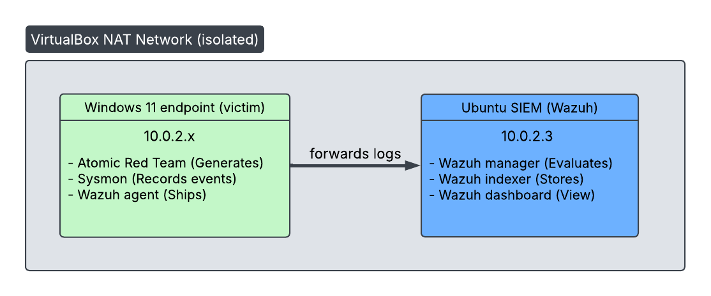

# Lab setup

The purpose of this document is to explain how the detection engineering lab was created so it can be reproduced with consistent results. At a fundamental level, it is comprised of a two-VM lab on an isolated network on a single host machine.

## Lab architecture

   

| Host | OS | Role | Key software |
|------|----|------|--------------|
| SIEM | Ubuntu 24.04 LTS (Desktop) | Log collection, detection, search | Wazuh (manager, indexer, dashboard) |
| endpoint | Windows 11 Enterprise Evaluation | Victim endpoint + attack generation | Sysmon, Wazuh agent, Atomic Red Team |
