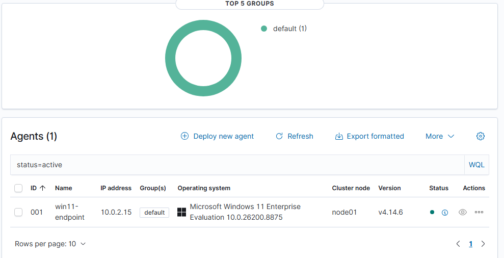

# Lab Setup

The purpose of this document is to explain how the detection engineering lab was created so it can be reproduced with consistent results. At a fundamental level, it is comprised of a two-VM lab on an isolated network on a single host machine.

## Lab architecture

   

| Host | OS | Role | Key software |
|------|----|------|--------------|
| SIEM | Ubuntu 24.04 LTS (Desktop) | Log collection, detection, search | Wazuh (manager, indexer, dashboard) |
| endpoint | Windows 11 Enterprise Evaluation | Victim endpoint + attack generation | Sysmon, Wazuh agent, Atomic Red Team |

## Networking

This lab would not work using a plain NAT network because that is used to isolate the machines from one another. On the other hand, the NAT network used puts them on a shared private network which allows for communication between them. This allows for the windows agent to ship its logs across to the SIEM on the ubuntu machine. This was verified initially by pinging the SIEM on the windows endpoint.

## Pipeline build steps

1. Host: VirtualBox installed then create a NAT Network in Tools -> Network
2. SIEM: Create an Ubuntu 24.04 LTS and configure it so it is on the shared NAT network, the system is updated and Wazuh is installed using the all-in-one quick start installer. Verify this by logging onto the dashboard on the browser.
3. Windows end point VM: Windows 11 Enterprise Evaluation ISO then attach it to the same NAT network as SIEM.
4. Logs: Install Sysmon with the SwiftOnSecurity config for high quality event tracing
5. Windows endpoint agent enrolment via the dashboards Add-agent wizard, pointing it at the SIEM's IP and then confirm it is active under the agents tab (see below)
 
7. Installed Atomic Red Team on the Windows endpoint to produce MITRE ATT&CK techniques through the command line on demand
