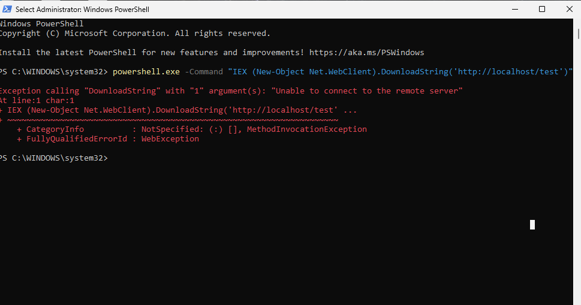
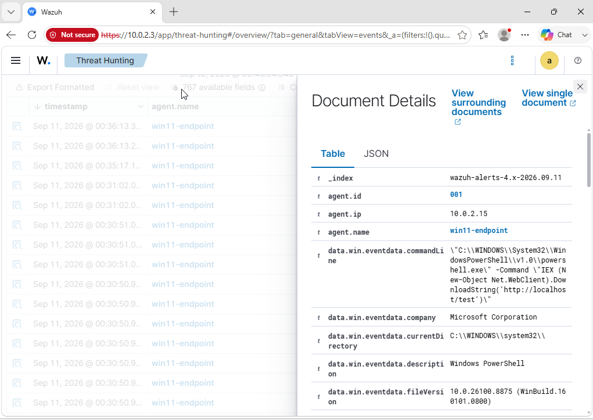

# Progress log

This document will be used to keep record of how the project is progressing and what I will work on next.

## Complete

- Configured a two-VM lab using VirutalBox on an isolated NAT network
- Built an Ubuntu SIEM running Wazuh. I chose this for the easy setup and it includes a manager, indexer and dashboard.
- Built the second VM running windows 11. This will be the endpoint and i enroled it as a Wazuh agent then verified it was active.
- Verified events flowing into the SIEM
- Installed Sysmon onto Windows endpoint with SwiftOnSecurity config for more relevant logs
- Installed Aomtic Red Team on Windows endpoint to simulate attack processes
- Generated the first attack technique using Atomic Red team. Powershell download cradle - generated and confirmed.
- Sysmon event forwarding to the SIEM is working - this was fixed by configuring the Wazuh agent to forward the correct channel (Microsoft-Windows-Sysmon/Operational) and by fixing the Wazuh manager failure so the agent connections are not refused.
- Pipeline tested and verified end to end - the powershell download-cradle command correctly captured by Sysmon, forwarded by the Wazuh agent and properly received by the manager so the threats/events were visible on the dashboard (Wazuh already has a built-in detection rules so it was flagged under MITRE Ingress Tool Transfer)

## In progress

## Next

1. Validate Sysmon events are shipped and appear in the SIEM correctly and make sure to take screenshots for the repo
2. Create the first Sigma detection for the powershell download-cradle)
3. Confirm if the sigma detection is firing once the Red Team Attack is generated
